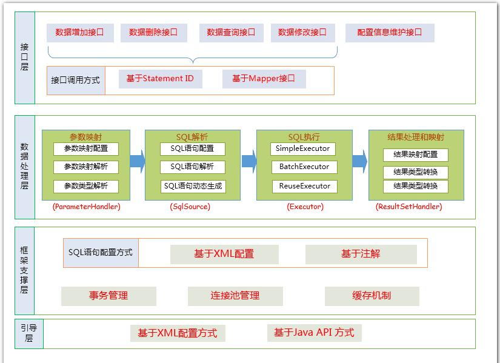

>**mybatis**

SqlSession（mybatis对外暴露的核心API）  
openSession()创建事务对象、创建执行器CacheingExecutor、创建DefaultSqlSession对象

Executor(执行器，负责数据库操作及两级缓存)  
抽象类：BaseExecutor   
子类：SimpleExecutor、BatchExecutor、ClosedExecutor、ReuseExecutor  
批量执行器：  
调用以下的组件，完成参数设置，解析sql获取，sql的执行、结果集的封装

StatementHandler(语句执行器，封装JDBC操作)

ParameterHandler(内部组件：参数处理器)

TypeHandler<T>(内部组件：类型转换器：完成java类型与jdbc类型的转换)

>**JDBC**

Statement

ResultSet(结果集)

>**Mybatis**

ResultSetHandler

TypeHandler<T>

一直往上返回